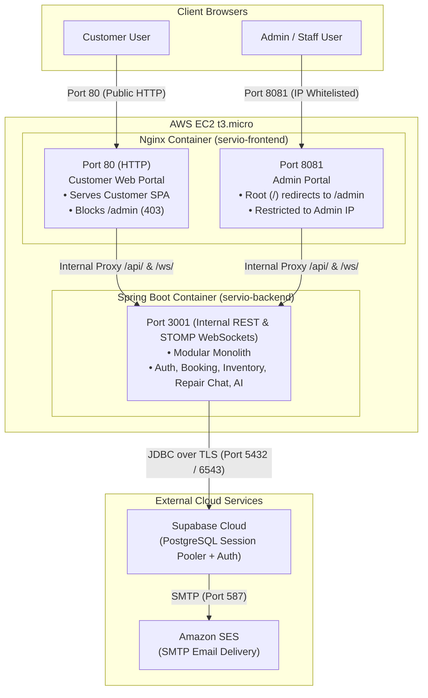
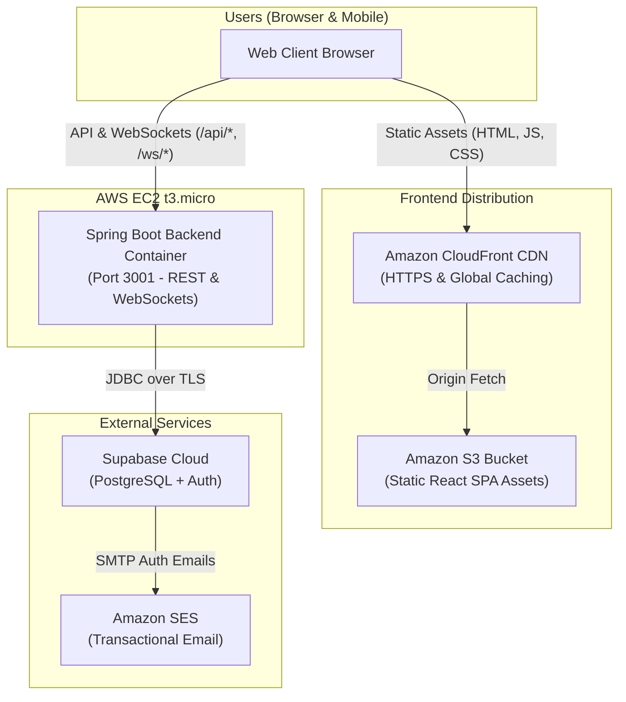
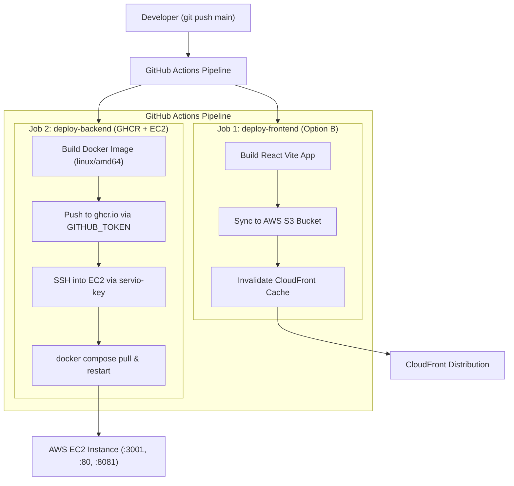
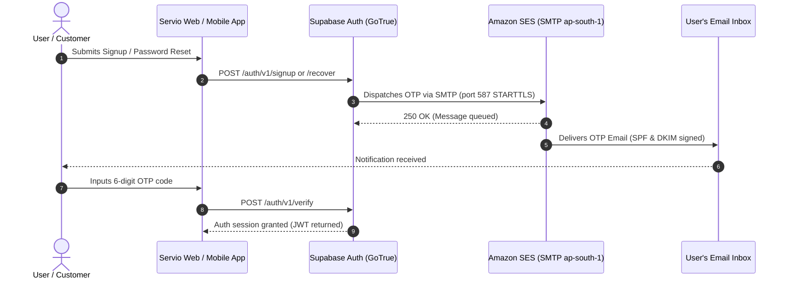
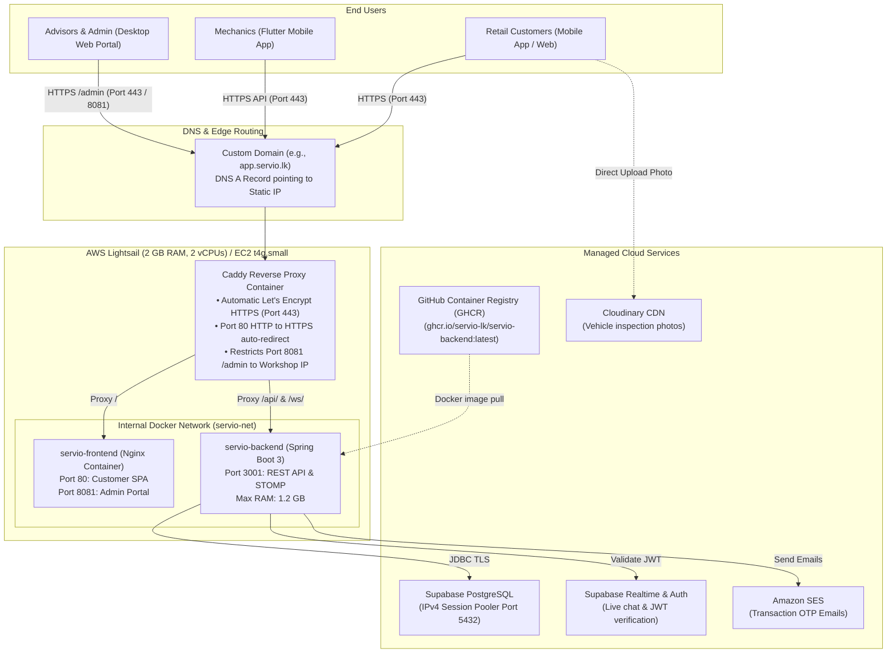

# 🚀 Servio — AWS Free Tier Hosting Guide

> Complete step-by-step guide for deploying the Servio web application on AWS Free Tier with a CI/CD pipeline using GitHub Actions.

> [!TIP]
> **Automated Deployment with Terraform (IaC)**:
> Want to provision this entire architecture automatically without running manual AWS CLI commands? Check out the [Terraform Modules](../terraform/README.md). A single `terraform apply` provisions the EC2 instance, Elastic IP, Security Groups, S3/CloudFront CDN, Amazon SES, and GitHub Actions OIDC roles in ~2 minutes!

---

## 1. Architecture Overview

Servio supports two deployment options on the AWS Free Tier, leveraging **GitHub Container Registry (GHCR)** for fast, free, and unified Docker image distribution:

### Option A: EC2 All-in-One Dual-Port Deployment (Recommended)
Runs both the Spring Boot backend and the Nginx frontend in lightweight Docker containers pulled directly from **GitHub Container Registry (GHCR)** on a single **EC2 t3.micro** instance:



**Why this option?**
- **Dual-Port Isolation**: Allows restricting port `8081` (Admin) to your IP address via AWS Security Groups, while keeping port `80` open to the public (`0.0.0.0/0`).
- **Zero CORS / Mixed-Content Issues**: Nginx proxies API calls (`/api/`) internally on the same host and origin.
- **Resource Fit**: Spring Boot (~500 MB) + Nginx (~15 MB) easily fits within the 1 GB RAM + 1 GB Swap on `t3.micro`.
- **Fast Pulls via GHCR**: Images are built by GitHub Actions and pulled from `ghcr.io` onto EC2 without building locally on a memory-constrained instance.

---

### Option B: Hybrid Deployment (S3 + CloudFront Frontend + EC2 Backend)
The customer frontend is hosted as static assets on S3 and distributed via CloudFront CDN, while the Spring Boot backend runs in Docker on EC2 pulled from GHCR:



### Free Tier Resource Budget

| Component | Service | Free Tier Limit | Resource Usage |
|---|---|---|---|
| Compute (Backend + Nginx) | EC2 t3.micro | 750 hrs/month (12 months) | 1 instance running 24/7 (~730 hrs/month) |
| Storage | EBS (gp3) | 30 GB | 20 GB root volume |
| Static CDN (Option B) | S3 + CloudFront | 5 GB + 1 TB transfer | ~50 MB bundle |
| Image Registry | GitHub Container Registry (GHCR) | **Free** (Unlimited for public repositories; 500 MB storage & 1 GB transfer/mo for private) | ~350 MB (Backend + optional Frontend image) |
| Database | Supabase (external) | Free tier | PostgreSQL + Auth + Realtime |
| Email (SMTP) | Amazon SES | 3,000 msgs/month (12 months) | Transactional OTPs & password resets |

---

## 2. Prerequisites

- **AWS Account** — New account with Free Tier eligibility ([sign up](https://aws.amazon.com/free/))
- **GitHub Account** — With the Servio repo (public)
- **AWS CLI** — Installed locally ([install guide](https://docs.aws.amazon.com/cli/latest/userguide/getting-started-install.html))
- **Git** — Installed locally
- **SSH Key Pair** — You'll create one in AWS

---

## 3. AWS Account Setup

### 3.1 Create AWS Account
1. Go to https://aws.amazon.com/free/
2. Sign up with your email
3. Add a payment method (you won't be charged if you stay within Free Tier)
4. Select the **Basic (Free)** support plan

### 3.2 Set Up Billing Alerts ⚠️
> This is critical to avoid unexpected charges.

1. Go to **Billing Dashboard** → **Billing preferences**
2. Enable **Receive Free Tier Usage Alerts**
3. Go to **CloudWatch** → **Alarms** → **Create Alarm**
4. Select metric: `Billing` → `Total Estimated Charge`
5. Set threshold: `> $1.00`
6. Add your email as a notification target

### 3.3 Create an IAM User for Deployment

1. Go to **IAM** → **Users** → **Create user**
2. Username: `servio-deployer`
3. Attach policies:
   - `AmazonEC2FullAccess`
   - `AmazonS3FullAccess`
   - `AmazonEC2ContainerRegistryFullAccess`
   - `CloudFrontFullAccess`
   - `AmazonSESFullAccess` *(only needed if managing SES via CLI; not required for SMTP sending)*
4. Go to **Security credentials** → **Create access key**
5. Select **Command Line Interface (CLI)**
6. Save the **Access Key ID** and **Secret Access Key** — you'll need these for GitHub Secrets

### 3.4 Configure AWS CLI Locally
```bash
aws configure
# AWS Access Key ID: <your-access-key>
# AWS Secret Access Key: <your-secret-key>
# Default region name: ap-south-1
# Default output format: json
```

---

## 4. Create an S3 Bucket for Frontend

### 4.1 Create the Bucket
```bash
aws s3 mb s3://servio-frontend --region ap-south-1
```

### 4.2 Enable Static Website Hosting
```bash
aws s3 website s3://servio-frontend \
  --index-document index.html \
  --error-document index.html
```

> The error document is set to `index.html` to support React Router's client-side routing.

### 4.3 Configure Bucket Settings
Ensure that "Block Public Access" remains **enabled**. We will grant access specifically to CloudFront in the next step, rather than making the bucket public to the internet.

### 4.4 Test: Upload Frontend Build Manually
```bash
cd frontend
npm ci && npm run build
aws s3 sync dist/ s3://servio-frontend --delete
```

The site is now accessible at:
```
http://servio-frontend.s3-website.ap-south-1.amazonaws.com
```

---

## 5. Set Up CloudFront CDN

CloudFront provides HTTPS, caching, and global distribution — all within Free Tier.

### 5.1 Create CloudFront Distribution (AWS 5-Step Wizard)

In the AWS Console, navigate to **CloudFront** → **Distributions** → **Create distribution**. Follow the wizard step-by-step:

#### Step 1: Get started
1. **Distribution name**: Enter a recognizable name, e.g., `servio-frontend` (stored as a resource tag).
2. **Description** *(optional)*: e.g., `Servio Web Application Frontend CDN`.
3. **Distribution type**: Select **Single website configuration** (*One configuration for one site. Best when this distribution's setup won't be reused elsewhere*).
4. **Route 53 managed domain** *(optional)*: Skip / Leave empty. (CloudFront automatically provisions a free default `*.cloudfront.net` domain with TLS. You can attach a custom Route 53 domain later if desired).
5. **Tags** *(optional)*: Add tags if desired (e.g. `Project: Servio`).
6. Click **Next**.

#### Step 2: Specify origin
1. **Origin domain**: Click the field and select your S3 bucket from Section 4:
   `servio-frontend.s3.ap-south-1.amazonaws.com` (or choose it from the Amazon S3 dropdown list).
   > **Note**: Do NOT use the S3 static website hosting endpoint URL here; select the S3 bucket REST endpoint directly so Origin Access Control (OAC) can authenticate requests.
2. **Origin access**: Select **Origin access control settings (recommended)**.
   - Under **Origin access control**, click **Create new OAC** if you don't already have one:
     - Name: `servio-frontend-oac` (default)
     - Origin type: **S3**
     - Signing behavior: **Sign requests (recommended)**
     - Click **Create**.
3. **Default cache behavior**:
   - **Viewer protocol policy**: Select **Redirect HTTP to HTTPS** (ensures all insecure traffic is automatically upgraded to HTTPS).
   - **Allowed HTTP methods**: Select **GET, HEAD** (sufficient for static single-page assets).
   - **Cache key and origin requests**: Select **Cache policy and origin request policy (recommended)**.
     - **Cache policy**: Select **CachingOptimized** (maximizes CloudFront cache hit ratio for static files).
4. Click **Next**.

#### Step 3: Enable security
1. **Web Application Firewall (WAF)**:
   > ⚠️ **Important for Free Tier**: Choose **Do not enable security protections** (or "Skip for now").
   > AWS WAF costs ~$5.00/month base fee + $1.00/rule/month, which is **NOT covered** by the AWS Free Tier. Leaving WAF off keeps your static hosting 100% free!
2. Click **Next**.

#### Step 4: Get TLS certificate
1. **Custom SSL/TLS certificate**:
   - Leave default / Skip (CloudFront automatically assigns its default SSL/TLS certificate for your `*.cloudfront.net` domain).
2. Click **Next**.

#### Step 5: Review and create
1. Under **Settings**:
   - **Default root object**: Enter **`index.html`**
     > ⚠️ **CRITICAL**: Do NOT leave this blank! If left blank, accessing `https://d1234567890.cloudfront.net/` directly will return a `403 Access Denied` error because CloudFront will not know which file to serve for the root path.
2. Review all parameters and click **Create distribution**.

---

### 5.2 Update S3 Bucket Policy for CloudFront OAC

Immediately after creation, CloudFront displays a banner at the top of the distribution overview:
> *"The S3 bucket policy needs to be updated. CloudFront provides an S3 bucket policy statement to grant read access to your bucket."*

1. Click **Copy policy** in the CloudFront banner.
2. Go to **Amazon S3** → **Buckets** → **`servio-frontend`** → **Permissions** tab.
3. Scroll down to **Bucket policy** → click **Edit**.
4. Paste the copied policy (or use the template below, replacing `<YOUR_ACCOUNT_ID>` and `<YOUR_DISTRIBUTION_ID>`):

```json
{
  "Version": "2012-10-17",
  "Statement": [
    {
      "Sid": "AllowCloudFrontServicePrincipal",
      "Effect": "Allow",
      "Principal": {
        "Service": "cloudfront.amazonaws.com"
      },
      "Action": "s3:GetObject",
      "Resource": "arn:aws:s3:::servio-frontend/*",
      "Condition": {
        "StringEquals": {
          "AWS:SourceArn": "arn:aws:cloudfront::<YOUR_ACCOUNT_ID>:distribution/<YOUR_DISTRIBUTION_ID>"
        }
      }
    }
  ]
}
```
5. Click **Save changes**.

---

### 5.3 Configure Custom Error Responses (SPA / React Router Support)

Because Servio's frontend is a React Single Page Application (SPA), all routing (e.g. `/services`, `/appointments`, `/profile`) is handled client-side in the browser. When a user navigates directly or refreshes on a sub-route, S3 returns a `403 Forbidden` or `404 Not Found` because a physical subfolder or file does not exist on disk. We must tell CloudFront to serve `/index.html` with a `200 OK` status instead:

1. In the CloudFront console, open your distribution.
2. Go to the **Error pages** tab.
3. Click **Create custom error response**:
   - **HTTP error code**: `403: Forbidden`
   - **Customize error response**: Select **Yes**
   - **Response page path**: `/index.html`
   - **HTTP response code**: `200: OK`
   - Click **Create custom error response**.
4. Repeat the process for HTTP 404:
   - Click **Create custom error response**.
   - **HTTP error code**: `404: Not Found`
   - **Customize error response**: Select **Yes**
   - **Response page path**: `/index.html`
   - **HTTP response code**: `200: OK`
   - Click **Create custom error response**.

---

### 5.4 Note your CloudFront URL and Distribution ID

1. On the distribution **General** tab:
   - **Distribution domain name**: e.g., `https://d1234567890.cloudfront.net` (This is your public frontend HTTPS URL).
   - **Distribution ID**: e.g., `E1234567890`
2. Save both values:
   - Add `https://d1234567890.cloudfront.net` to `CORS_ALLOWED_ORIGINS` and `FRONTEND_URL` in your backend `.env` on EC2.
   - Add the **Distribution ID** to GitHub repository secrets as `CLOUDFRONT_DISTRIBUTION_ID` for automatic CI/CD cache invalidation.

---

## 6. Set Up GitHub Container Registry (GHCR)

Instead of using AWS ECR (which has a strict 500 MB Free Tier limit and requires rotating 12-hour auth tokens), we use **GitHub Container Registry (GHCR)** at `ghcr.io`.

### Why GHCR?
- **Zero Cost & Generous Limits**: Free and unlimited download bandwidth and storage for public repositories; generous 500 MB storage & 1 GB transfer/month for private repositories.
- **Native GitHub Actions Integration**: GitHub Actions workflows push to GHCR using the built-in, auto-generated `${{ secrets.GITHUB_TOKEN }}` without requiring AWS IAM access keys.
- **Persistent Auth on EC2**: Unlike AWS ECR (whose authorization tokens expire every 12 hours), logging into GHCR with a Personal Access Token (PAT) persists in `~/.docker/config.json`. If you make your package public, EC2 can pull images **with zero credentials**!
- **Multi-Cloud Ready**: Images stored in GHCR can be pulled to EC2, Lightsail, App Runner, or any local test machine.

### 6.1 Generate a GitHub Personal Access Token (PAT)

You need a Personal Access Token to authenticate Docker with GHCR from your local terminal and on EC2:

1. Go to GitHub → **Settings** (your profile top right) → **Developer settings** → **Personal access tokens** → **Tokens (classic)**
2. Click **Generate new token (classic)**
3. Name: `servio-ghcr-token`
4. Expiration: 90 days (or No expiration for production)
5. Select scopes:
   - `write:packages` (uploads images to GitHub Packages)
   - `read:packages` (downloads images from GitHub Packages)
   - `delete:packages` (optional — allows cleanup)
6. Click **Generate token** and **copy the token immediately** (`ghp_...`).

### 6.2 Log In to GHCR Locally

```bash
export CR_PAT="ghp_yourPersonalAccessTokenHere"

# Log in to ghcr.io
echo $CR_PAT | docker login ghcr.io -u <YOUR_GITHUB_USERNAME> --password-stdin
```

> You should see: `Login Succeeded`.

### 6.3 Build and Push Backend Image to GHCR

You have two ways to get the image into GHCR:

#### Option A: Push Manually from your Local Machine (Fastest for first setup)
From your project root on your local computer:

```bash
# 1. Set your GitHub username or organization (MUST be lowercase)
export GH_USER="servio-lk"

# 2. Build for linux/amd64 (matches EC2 architecture)
docker build --platform linux/amd64 -t ghcr.io/${GH_USER}/servio-backend:latest ./backend

# 3. Push to GitHub Container Registry
docker push ghcr.io/${GH_USER}/servio-backend:latest
```

#### Option B: Let GitHub Actions Push Automatically
Pushing code to the `main` branch automatically triggers the `deploy-backend` workflow in `.github/workflows/deploy.yml`, which builds and pushes the image to GHCR using the built-in `GITHUB_TOKEN`.

---

### 6.4 Public vs. Private Package Visibility

After your first image push (via local Docker or GitHub Actions), the package will appear under your GitHub profile or organization:
- Go to `https://github.com/orgs/Servio-lk/packages` (or `https://github.com/<YOUR_GITHUB_USERNAME>?tab=packages`)
- Click `servio-backend` → **Package settings**
- Scroll to the bottom **Danger Zone**:
  - **Make Public**: Anyone (and your EC2 instance) can pull the image without needing to configure authentication on EC2. Highly recommended for open-source / university projects.
  - **Keep Private**: EC2 will need a one-time `docker login ghcr.io` using your PAT with `read:packages` scope.

---

## 7. Launch EC2 Instance

### 7.1 Create Key Pair
```bash
aws ec2 create-key-pair \
  --key-name servio-key \
  --query "KeyMaterial" \
  --output text > servio-key-new.pem

chmod 400 servio-key-new.pem
```

> **Note (If you get `InvalidKeyPair.Duplicate`)**:  
> If AWS says `The keypair already exists`:
> - **If you already have `servio-key-new.pem` locally**: You are good to go! Just run `chmod 400 servio-key-new.pem` and continue to step 7.2.
> - **If you lost the previous `.pem` file**: Delete the old keypair first (`aws ec2 delete-key-pair --key-name servio-key`) and re-run the command above, or create one with a new name like `--key-name servio-key-v2`.

### 7.2 Create Security Group
```bash
# 1. Detect your current public IP automatically:
MY_IP=$(curl -s checkip.amazonaws.com)
echo "Your Public IP is: $MY_IP"

# 2. Create security group
aws ec2 create-security-group \
  --group-name servio-sg \
  --description "Servio Web & Backend Security Group"

# 3. Allow SSH (port 22) - Restricted to your IP
aws ec2 authorize-security-group-ingress \
  --group-name servio-sg \
  --protocol tcp \
  --port 22 \
  --cidr "${MY_IP}/32"

# 4. Allow Customer Web Portal (port 80) — Public HTTP access
aws ec2 authorize-security-group-ingress \
  --group-name servio-sg \
  --protocol tcp \
  --port 80 \
  --cidr 0.0.0.0/0

# 5. Allow Admin Portal (port 8081) — RESTRICTED TO YOUR IP ONLY for security
aws ec2 authorize-security-group-ingress \
  --group-name servio-sg \
  --protocol tcp \
  --port 8081 \
  --cidr "${MY_IP}/32"

# 6. Allow Backend API (port 3001) - For direct REST/WebSocket access or test verification
aws ec2 authorize-security-group-ingress \
  --group-name servio-sg \
  --protocol tcp \
  --port 3001 \
  --cidr 0.0.0.0/0

# 7. Allow HTTPS (port 443)
aws ec2 authorize-security-group-ingress \
  --group-name servio-sg \
  --protocol tcp \
  --port 443 \
  --cidr 0.0.0.0/0
```

> 🔒 **Security Note**: Port `8081` serves the admin panel frontend. By restricting this rule to `<YOUR_IP_ADDRESS>/32`, external users cannot reach the admin portal even if they know the port number. You can update this rule anytime from the AWS EC2 Console under **Security Groups** → **Edit inbound rules**.

### 7.3 Launch the Instance

```bash
aws ec2 run-instances \
  --image-id ami-0f58b397bc5c1f2e8 \
  --instance-type t3.micro \
  --key-name servio-key \
  --security-groups servio-sg \
  --block-device-mappings '[{"DeviceName":"/dev/xvda","Ebs":{"VolumeSize":20,"VolumeType":"gp3"}}]' \
  --tag-specifications 'ResourceType=instance,Tags=[{Key=Name,Value=servio-backend}]' \
  --count 1
```

> **Note**: `t2.micro` is **no longer free tier eligible** in `ap-south-1`. Use `t3.micro` instead. You can check eligible types with:
> ```bash
> aws ec2 describe-instance-types --region ap-south-1 \
>   --filters Name=free-tier-eligible,Values=true \
>   --query "InstanceTypes[].InstanceType" --output table
> ```
> The AMI ID `ami-0f58b397bc5c1f2e8` is for **Ubuntu 24.04 LTS** in `ap-south-1`. The default SSH username is `ubuntu` (not `ec2-user`). If you're using a different region, find the correct AMI ID in the AWS Console under EC2 → Launch Instance.

### 7.4 Allocate Elastic IP (Free if associated)
```bash
# Allocate
ALLOC_ID=$(aws ec2 allocate-address --query "AllocationId" --output text)

# Get instance ID
INSTANCE_ID=$(aws ec2 describe-instances \
  --filters "Name=tag:Name,Values=servio-backend" "Name=instance-state-name,Values=running" \
  --query "Reservations[0].Instances[0].InstanceId" \
  --output text)

# Associate
aws ec2 associate-address --instance-id $INSTANCE_ID --allocation-id $ALLOC_ID

# Show the public IP
aws ec2 describe-addresses --allocation-ids $ALLOC_ID --query "Addresses[0].PublicIp" --output text
```

Save this IP address — it's your backend URL: `http://<ELASTIC_IP>:3001`

---

## 8. Install Docker on EC2

### 8.1 SSH into the Instance
```bash
ssh -i servio-key-new.pem ubuntu@<ELASTIC_IP>
```

### 8.2 Install Docker & Docker Compose

On Ubuntu 24.04 LTS (Noble), install Docker and Docker Compose v2:

```bash
# 1. Update package lists
sudo apt update && sudo apt upgrade -y

# 2. Install Docker and Docker Compose v2
sudo apt install -y docker.io docker-compose-v2

# 3. Start and enable Docker service
sudo systemctl start docker
sudo systemctl enable docker

# 4. Allow the ubuntu user to run Docker without sudo
sudo usermod -aG docker ubuntu

# 5. (Optional) Install AWS CLI v2 (Ubuntu 24.04 removed the old 'awscli' apt package)
sudo apt install -y unzip
curl "https://awscli.amazonaws.com/awscli-exe-linux-x86_64.zip" -o "awscliv2.zip"
unzip -q awscliv2.zip
sudo ./aws/install
rm -rf awscliv2.zip ./aws

# 6. Apply docker group membership (or exit and SSH back in)
newgrp docker

# 7. Verify installations
docker --version
docker compose version
aws --version

---

## 9. Configure the EC2 Instance

### 9.1 Enable Swap Space (Critical for t3.micro!)

The t3.micro only has 1 GB RAM. Swap prevents out-of-memory kills.

```bash
# Create 1 GB swap file
sudo dd if=/dev/zero of=/swapfile bs=1M count=1024
sudo chmod 600 /swapfile
sudo mkswap /swapfile
sudo swapon /swapfile

# Make permanent
echo '/swapfile swap swap defaults 0 0' | sudo tee -a /etc/fstab

# Verify
free -h
```

### 9.2 Log In to GitHub Container Registry (GHCR) on EC2

Since container images are hosted on GHCR (`ghcr.io`), configure Docker on EC2 to pull them:

#### If Package is Public (Recommended):
No login is needed on EC2! Docker can pull public images directly:
```bash
docker pull ghcr.io/<YOUR_GITHUB_USERNAME>/servio-backend:latest
```

#### If Package is Private:
Log in once on the EC2 instance using your Personal Access Token (PAT) with `read:packages` scope:
```bash
export CR_PAT="ghp_yourPersonalAccessTokenHere"
echo $CR_PAT | docker login ghcr.io -u <YOUR_GITHUB_USERNAME> --password-stdin
```
> The credentials are saved in `~/.docker/config.json` and persist across instance reboots.

### 9.3 Set Up the Application Directory

```bash
mkdir -p /home/ubuntu/servio
cd /home/ubuntu/servio
```

### 9.4 Create the `.env` File

```bash
cat > .env << 'EOF'
# ---- Port Configuration ----
FRONTEND_PORT=80
ADMIN_PORT=8081
BACKEND_PORT=3001

# ---- Container Image (GHCR) ----
# Replace <YOUR_GITHUB_USERNAME> with your GitHub user or organization name (lowercase)
BACKEND_IMAGE=ghcr.io/<YOUR_GITHUB_USERNAME>/servio-backend:latest

# ---- Supabase Database (Session Pooler — IPv4 compatible) ----
# Get these from: Supabase Dashboard → Database → Connect → Session Pooler
DB_HOST=aws-1-ap-south-1.pooler.supabase.com
DB_PORT=5432
DB_USER=postgres.your-project-ref
DB_PASSWORD=your-db-password
DB_NAME=postgres

# ---- Supabase Auth ----
SUPABASE_URL=https://your-project-ref.supabase.co
SUPABASE_ANON_KEY=your-supabase-anon-key
SUPABASE_JWT_SECRET=your-supabase-jwt-secret
SUPABASE_SERVICE_ROLE_KEY=your-supabase-service-role-key

# ---- JWT ----
JWT_SECRET=your-production-jwt-secret
JWT_EXPIRATION=604800000

# ---- CORS & Client URLs ----
# Include your Elastic IP (ports 80 & 8081), CloudFront URL, and local dev
CORS_ALLOWED_ORIGINS=http://<ELASTIC_IP>,http://<ELASTIC_IP>:80,http://<ELASTIC_IP>:8081,https://d1234567890.cloudfront.net,http://localhost:5173
FRONTEND_URL=http://<ELASTIC_IP>:80,http://<ELASTIC_IP>:8081

# ---- PayHere Payment Gateway ----
PAYHERE_MERCHANT_ID=1219999
PAYHERE_MERCHANT_SECRET=your-merchant-secret
PAYHERE_SANDBOX=false
PAYHERE_NOTIFY_URL=http://<ELASTIC_IP>:3001/api/payments/payhere-notify

# ---- Cloudinary Media (Optional) ----
CLOUDINARY_CLOUD_NAME=
CLOUDINARY_API_KEY=
CLOUDINARY_API_SECRET=

# ---- Google Gemini AI Assistant ----
GEMINI_API_KEY=your-gemini-api-key
GEMINI_MODEL=gemini-1.5-flash
EOF
```

> ⚠️ Replace all placeholder values (`<ELASTIC_IP>`, `your-project-ref`, `<YOUR_GITHUB_USERNAME>`) with your actual values.
> **Important:** Do NOT use the direct database connection (`db.xxx.supabase.co`). It resolves to IPv6 only, which EC2 instances typically can't reach. Always use the **Session Pooler** connection from the Supabase Dashboard.

### 9.5 Copy the Deployment Files to EC2

```bash
# From your local machine repository root:
# 1. Copy the production compose file
scp -i servio-key-new.pem docker-compose.prod.yml ubuntu@<ELASTIC_IP>:/home/ubuntu/servio/

# 2. (For Option A — EC2 Dual-Port Frontend): Copy the frontend project to build the Nginx container
scp -i servio-key-new.pem -r frontend ubuntu@<ELASTIC_IP>:/home/ubuntu/servio/
```

---

## 10. First Manual Deploy

### 10.1 Build and Push Backend Image to GHCR (from your local machine)

```bash
# Export your PAT and log in to ghcr.io
export CR_PAT="ghp_yourPersonalAccessTokenHere"
echo $CR_PAT | docker login ghcr.io -u <YOUR_GITHUB_USERNAME> --password-stdin

# Build the backend image targeting EC2 x86_64
docker build --platform linux/amd64 -t ghcr.io/<YOUR_GITHUB_USERNAME>/servio-backend:latest ./backend

# Push to GitHub Container Registry
docker push ghcr.io/<YOUR_GITHUB_USERNAME>/servio-backend:latest
```

> **Tip:** If this is your first push to GHCR, navigate to GitHub → **Packages** → `servio-backend` → **Package settings** → **Danger Zone** → **Change package visibility** → choose **Public** so EC2 can pull without credentials.

### 10.2 Deploy on EC2

```bash
# SSH into EC2
ssh -i servio-key-new.pem ubuntu@<ELASTIC_IP>

cd /home/ubuntu/servio

# ──────── Option A: Full-Stack on EC2 (Recommended for Dual-Port Frontend) ────────
# Pulls the backend from GHCR and builds the lightweight Nginx container:
docker compose -f docker-compose.prod.yml pull
docker compose -f docker-compose.prod.yml --profile all up -d --build

# ──────── Option B: Backend Only on EC2 (If using S3 + CloudFront for Frontend) ────────
# docker compose -f docker-compose.prod.yml pull
# docker compose -f docker-compose.prod.yml up -d

# Check status of running containers:
docker compose -f docker-compose.prod.yml ps
docker compose -f docker-compose.prod.yml logs -f backend
```

### 10.3 Deploy Frontend to S3 (Only for Option B — S3 + CloudFront)

```bash
# From your local machine (if using Option B)
cd frontend
VITE_API_URL=http://<ELASTIC_IP>:3001/api \
VITE_SUPABASE_URL=https://your-ref.supabase.co \
VITE_SUPABASE_ANON_KEY=your-key \
  npm run build

aws s3 sync dist/ s3://servio-frontend --delete
```

### 10.4 Verify Deployments

#### If using Option A (EC2 Dual-Port All-in-One):
- **Customer Web Portal**: Visit `http://<ELASTIC_IP>` (Port 80)
  - Browsing `/home`, `/services`, `/login` works.
  - Attempting to visit `/admin` on port 80 returns `403 Forbidden: Admin portal is restricted to the admin port`.
- **Admin Portal**: Visit `http://<ELASTIC_IP>:8081` (Port 8081)
  - Automatically redirects root `/` directly to `/admin`.
  - Accessible only from your whitelisted IP address!
- **Backend API Direct**: Visit `http://<ELASTIC_IP>:3001/actuator/health` or `http://<ELASTIC_IP>:3001/api/services`

#### If using Option B (S3 + CloudFront):
- **Frontend**: Visit your CloudFront URL `https://d1234567890.cloudfront.net`
- **Backend**: Visit `http://<ELASTIC_IP>:3001/api/services`

---

## 11. Set Up CI/CD Pipeline

The CI/CD pipeline uses **GitHub Actions** to automatically deploy on every push to `main`.

### 11.1 Architecture



### 11.2 Add GitHub Secrets

Go to your GitHub repo → **Settings** → **Secrets and variables** → **Actions** → **New repository secret**

> **Note on GHCR:** Notice that no container registry credentials are required! GitHub Actions automatically supplies `secrets.GITHUB_TOKEN` with `packages: write` permissions to push directly to GHCR.

Add the following repository secrets:

| Secret Name | Value | Purpose |
|---|---|---|
| `EC2_HOST` | `<ELASTIC_IP>` | Your EC2 Elastic IP address for SSH deployment |
| `EC2_SSH_KEY` | `-----BEGIN RSA PRIVATE...` | Entire contents of `servio-key-new.pem` private key |
| `AWS_ACCESS_KEY_ID` *(or `AWS_ROLE_ARN`)* | `AKIA...` | AWS Access Key ID for S3/CloudFront deployment |
| `AWS_SECRET_ACCESS_KEY` | `wJalr...` | AWS Secret Access Key (paired with `AWS_ACCESS_KEY_ID`) |
| `SUPABASE_URL` | `https://xxx.supabase.co` | Supabase project URL (used during Vite production build) |
| `SUPABASE_ANON_KEY` | `eyJ...` | Supabase anonymous public key |
| `VITE_API_URL` | `http://<ELASTIC_IP>:3001/api` | Backend API URL embedded into Vite static bundle |

Optional Variables (Under **Secrets and variables** → **Actions** → **Variables** tab):
- `CLOUDFRONT_DISTRIBUTION_ID`: CloudFront distribution ID (e.g. `E1234567890`) for automatic cache invalidation.

### 11.3 Workflow File

The workflow file is configured at `.github/workflows/deploy.yml`. It runs two concurrent jobs:

1. **`deploy-frontend`**: Builds the React single-page app with Vite, syncs assets to S3, and invalidates the CloudFront cache.
2. **`deploy-backend`**: Builds the Spring Boot Docker container for `linux/amd64`, authenticates to `ghcr.io` using the built-in `GITHUB_TOKEN`, pushes tags `latest` and `${{ github.sha }}`, and triggers a zero-downtime rolling restart on EC2 via SSH.

### 11.4 Trigger a Deploy

```bash
git add .
git commit -m "feat: add CI/CD pipeline with GHCR container registry"
git push origin main
```

Monitor pipeline progress at: `https://github.com/<YOUR_GITHUB_USERNAME>/Servio/actions`

---

## 12. HTTPS & Custom Domain (Optional)

Since this is a university project without a domain name, you can use:

- **Frontend**: CloudFront provides HTTPS automatically at `https://d1234567890.cloudfront.net`
- **Backend**: For HTTPS on EC2 without a domain, you have a few options:

### Option A: Use HTTP (Simplest — Recommended for University Project)
- Frontend (CloudFront) → HTTPS ✅
- Backend API calls → HTTP (port 3001)
- Update CORS to allow your CloudFront HTTPS origin

### Option B: Free Domain + Let's Encrypt (If you want full HTTPS)
1. Get a free domain from [Freenom](https://www.freenom.com/) or use your university's subdomain
2. Install Certbot on EC2:
```bash
sudo dnf install -y certbot
sudo certbot certonly --standalone -d api.servio.example.com
```

For a university project, **Option A is perfectly fine**.

---

## 13. Monitoring & Logs

### View Container Logs on EC2
```bash
ssh -i servio-key-new.pem ubuntu@<ELASTIC_IP>

# Live logs
docker compose -f docker-compose.prod.yml logs -f backend

# Last 100 lines
docker compose -f docker-compose.prod.yml logs --tail 100 backend

# Check resource usage
docker stats
```

### EC2 Instance Monitoring
- Go to **EC2** → Select your instance → **Monitoring** tab
- View CPU, network, and disk metrics (free with EC2)

### Set Up a Simple Health Check Script
```bash
# On EC2, create a cron job to auto-restart if backend goes down
cat > /home/ubuntu/health-check.sh << 'SCRIPT'
#!/bin/bash
if ! curl -sf http://localhost:3001/api/services > /dev/null 2>&1; then
  echo "$(date): Backend is down, restarting..." >> /home/ubuntu/health-check.log
  cd /home/ubuntu/servio
  docker compose -f docker-compose.prod.yml restart backend
fi
SCRIPT

chmod +x /home/ubuntu/health-check.sh

# Run every 5 minutes
(crontab -l 2>/dev/null; echo "*/5 * * * * /home/ubuntu/health-check.sh") | crontab -
```

---

## 14. Cost Optimization

### Free Tier Limits (12 months)

| Service | Free Limit | Your Usage | Status |
|---|---|---|---|
| EC2 t3.micro | 750 hrs/month | ~730 hrs (24/7) | ✅ Within limit |
| EBS (gp3) | 30 GB | 20 GB | ✅ Within limit |
| S3 | 5 GB storage | ~50 MB (frontend) | ✅ Within limit |
| S3 Requests | 20K GET, 2K PUT | Varies | ✅ Likely within limit |
| CloudFront | 1 TB transfer | Low traffic | ✅ Within limit |
| GHCR (GitHub) | Unlimited public / 500 MB private | Free (zero AWS ECR cost) | ✅ Completely Free |
| Data Transfer | 100 GB out | Low traffic | ✅ Within limit |
| Elastic IP | Free (if associated) | 1 IP, associated | ✅ Free |
| SES (Email) | 3,000 msgs/month | Auth emails only | ✅ Within limit |

### Tips to Stay Within Free Tier

1. **Never run more than 1 EC2 instance** — 750 hrs is for all t3.micro instances combined.
2. **Use GHCR instead of AWS ECR** — GHCR has zero transfer costs between GitHub Actions and your servers, and no 500 MB hard storage cap for public packages.
3. **Don't enable CloudWatch Detailed Monitoring** — basic monitoring is free.
4. **Stop the EC2 instance when not needed** (e.g., during semester breaks):
   ```bash
   # Stop
   aws ec2 stop-instances --instance-ids <INSTANCE_ID>
   # Start
   aws ec2 start-instances --instance-ids <INSTANCE_ID>
   ```
5. **Release the Elastic IP if the instance is stopped** — an unassociated Elastic IP incurs hourly charges (~$0.005/hr).

### After Free Tier Expires (12 months)

Estimated monthly cost for this architecture:
- EC2 t3.micro: ~$7.60/month
- EBS 20 GB: ~$1.60/month  
- S3 + CloudFront: ~$0.50/month
- GHCR Container Registry: **$0.00/month** (Free for public packages)
- SES: ~$0.10/month (at low volume)
- **Total: ~$9.80/month**

---

## 15. Troubleshooting

### Backend won't start (Out of Memory)
```bash
# Check if swap is enabled
free -h

# If no swap, enable it (see Section 9.1)

# Check container memory usage
docker stats --no-stream

# Reduce JVM memory if needed — edit docker-compose.prod.yml
# Or set env var: JAVA_OPTS=-Xmx256m
```

### CORS Errors in Browser
```bash
# Ensure CORS_ALLOWED_ORIGINS in .env includes your frontend origin (ports 80, 8081, CloudFront)
CORS_ALLOWED_ORIGINS=http://<ELASTIC_IP>,http://<ELASTIC_IP>:80,http://<ELASTIC_IP>:8081,https://d1234567890.cloudfront.net

# Restart backend
cd /home/ubuntu/servio
docker compose -f docker-compose.prod.yml restart backend
```

### GHCR Login Failed or "denied: permission_denied"
- **Cause 1**: The Personal Access Token (PAT) lacks the `read:packages` or `write:packages` scope.
- **Cause 2**: Your GitHub username or organization name contains uppercase characters. GHCR requires **all lowercase** image paths (e.g. `ghcr.io/servio-lk/servio-backend:latest`, NOT `ghcr.io/Servio-LK/...`).
- **Fix**: Re-authenticate with a token that has package permissions:
```bash
export CR_PAT="ghp_yourTokenHere"
echo $CR_PAT | docker login ghcr.io -u <YOUR_GITHUB_USERNAME_LOWERCASE> --password-stdin
```

### GitHub Actions Failing
1. Check **Actions** tab on GitHub for error logs.
2. Common issues:
   - **SSH connection refused**: Ensure EC2 security group allows port 22.
   - **GHCR package publish denied**: Verify repository **Settings** → **Actions** → **General** → **Workflow permissions** is set to **Read and write permissions**.
   - **S3 access denied**: Check IAM policy includes `AmazonS3FullAccess` (for Option B).

### Container keeps restarting
```bash
# Check logs for the error
docker compose -f docker-compose.prod.yml logs backend

# Common causes:
# - Wrong DB credentials in .env
# - Supabase connection blocked (check Supabase dashboard → Database → Connection Pooling)
# - Port 3001 already in use
```

### Frontend shows blank page
1. Check browser console for errors.
2. Ensure `VITE_API_URL` was set correctly during the build.
3. Verify CloudFront custom error pages are configured (Section 5.2).
4. Check S3 bucket contents: `aws s3 ls s3://servio-frontend/`.

### Disk Space Running Low
```bash
# Clean up Docker unused images, containers, and build cache
docker system prune -af
docker volume prune -f

# Check disk usage
df -h
```

### Docker compose pull fails: `repository not found or denied`
- **Cause**: The package on GHCR is private and EC2 has not logged in, or the image name in `.env` has a typo or uppercase letters.
- **Fix**: 
  1. Check `.env`: `BACKEND_IMAGE=ghcr.io/<your-github-username-in-lowercase>/servio-backend:latest`.
  2. If the package is private, log in on EC2: `echo $CR_PAT | docker login ghcr.io -u <username> --password-stdin`.
  3. Alternatively, make the package public on GitHub: Package Settings → Danger Zone → Change visibility to Public.

### Cannot connect to Admin Portal (Port 8081 Timeout)
- **Cause**: Your public IP address changed, or port `8081` is not authorized in the EC2 Security Group.
- **Fix**: Check your current IP (via `curl ifconfig.me`) and update the Security Group inbound rule:
```bash
aws ec2 authorize-security-group-ingress \
  --group-name servio-sg \
  --protocol tcp \
  --port 8081 \
  --cidr $(curl -s ifconfig.me)/32
```

### `403 Forbidden: Admin portal is restricted to the admin port`
- **Cause**: You attempted to open `/admin` while connected to the Customer portal on port `80` (or root domain).
- **Fix**: Access the admin portal using the dedicated admin port: `http://<ELASTIC_IP>:8081`.

### AI Assistant reports `GEMINI_API_KEY is not configured`
- **Cause**: `GEMINI_API_KEY` was omitted in `/home/ubuntu/servio/.env`.
- **Fix**: Add `GEMINI_API_KEY=your-api-key` to `.env` on EC2, then restart the backend:
```bash
docker compose -f docker-compose.prod.yml restart backend
```

---

## Quick Reference

```bash
# ────── SSH into EC2 ──────
ssh -i servio-key-new.pem ubuntu@<ELASTIC_IP>

# ────── Container Management ──────
cd /home/ubuntu/servio
docker compose -f docker-compose.prod.yml up -d       # Start
docker compose -f docker-compose.prod.yml down         # Stop
docker compose -f docker-compose.prod.yml restart      # Restart
docker compose -f docker-compose.prod.yml logs -f      # Live logs
docker compose -f docker-compose.prod.yml ps           # Status

# ────── Deploy Manually ──────
# Backend:
docker compose -f docker-compose.prod.yml pull
docker compose -f docker-compose.prod.yml up -d

# Frontend (Option B):
aws s3 sync frontend/dist/ s3://servio-frontend --delete

# ────── Useful URLs ──────
# Frontend (Option A): http://<ELASTIC_IP>
# Admin (Option A):    http://<ELASTIC_IP>:8081
# Frontend (Option B): https://d1234567890.cloudfront.net
# Backend API:         http://<ELASTIC_IP>:3001/api/services
# GitHub Actions:      https://github.com/<username>/Servio/actions
# GitHub Packages:     https://github.com/<username>?tab=packages
```

---

## 16. Set Up Amazon SES for Supabase Email

Supabase's built-in email service has **strict rate limits** (3 emails/hour on the free plan) and sends from a generic `noreply@mail.app.supabase.io` address. For production use — especially signup OTP verification, password resets, and email confirmations — you should configure **Amazon SES** as a custom SMTP provider.

> **Why SES?** You're already on AWS, it's included in the Free Tier (3,000 messages/month for 12 months), and it provides high deliverability with SPF/DKIM authentication.



### 16.1 Choose Your SES Region

Amazon SES is available in specific regions. Pick the one closest to your Supabase project:

| Region | SMTP Endpoint |
|---|---|
| Mumbai (ap-south-1) | `email-smtp.ap-south-1.amazonaws.com` |
| US East (us-east-1) | `email-smtp.us-east-1.amazonaws.com` |
| EU (eu-west-1) | `email-smtp.eu-west-1.amazonaws.com` |
| Singapore (ap-southeast-1) | `email-smtp.ap-southeast-1.amazonaws.com` |

> Since your infrastructure is in `ap-south-1`, use the Mumbai endpoint for the lowest latency.

### 16.2 Verify a Sender Identity

SES requires you to verify the email address or domain you'll send from.

#### Option A: Verify an Email Address (Quickest — Good for Testing)

1. Go to **Amazon SES Console** → **Verified identities** → **Create identity**
2. Select **Email address**
3. Enter your sender email (e.g., `noreply@servio.lk` or `servio.team@gmail.com`)
4. Click **Create identity**
5. Check your inbox and click the verification link from AWS

#### Option B: Verify a Domain (Recommended for Production)

1. Go to **Amazon SES Console** → **Verified identities** → **Create identity**
2. Select **Domain**
3. Enter your domain (e.g., `servio.lk`)
4. Enable **DKIM** (Easy DKIM is recommended)
5. Click **Create identity**
6. Add the DNS records AWS provides to your domain registrar:

```
# Example DNS records SES will ask you to add:

# DKIM (3 CNAME records)
xxxxxxxx._domainkey.servio.lk  →  xxxxxxxx.dkim.amazonses.com
yyyyyyyy._domainkey.servio.lk  →  yyyyyyyy.dkim.amazonses.com
zzzzzzzz._domainkey.servio.lk  →  zzzzzzzz.dkim.amazonses.com

# SPF (TXT record — add to existing or create new)
servio.lk  TXT  "v=spf1 include:amazonses.com ~all"

# Optional: Custom MAIL FROM domain
mail.servio.lk  MX   10 feedback-smtp.ap-south-1.amazonses.com
mail.servio.lk  TXT  "v=spf1 include:amazonses.com ~all"
```

> ⚠️ DNS propagation can take up to 72 hours, but usually completes within 1–2 hours.

### 16.3 Request Production Access (Exit Sandbox)

By default, new SES accounts are in **Sandbox mode** — you can only send emails to verified addresses. To send to any recipient (i.e., your actual users), you must request production access.

1. Go to **Amazon SES Console** → **Account dashboard**
2. In the **Sending statistics** section, click **Request production access**
3. Fill in the request:
   - **Mail type**: Transactional
   - **Website URL**: Your application URL
   - **Use case description**: Example below

```
We are building Servio, a vehicle service management platform. 
We need SES for transactional emails only:
- Signup email OTP verification codes
- Password reset links
- Account confirmation emails

Estimated volume: <100 emails/day.
We have a clear unsubscribe process and do not send marketing emails.
Bounce/complaint notifications will be monitored via SES dashboard.
```

4. Click **Submit request**

> ⏱️ AWS typically reviews and approves within 24 hours. You can continue with sandbox testing (using verified emails) while you wait.

### 16.4 Create SMTP Credentials

1. Go to **Amazon SES Console** → **SMTP settings** (left sidebar)
2. Note the **SMTP endpoint** for your region (e.g., `email-smtp.ap-south-1.amazonaws.com`)
3. Click **Create SMTP credentials**
4. This opens the IAM console — leave the default IAM user name or customize it
5. Click **Create user**
6. **Save the credentials immediately** — you won't be able to see the password again:

| Field | Value Format | Note |
|---|---|---|
| **SMTP Username** | `AKIA...` | Specific IAM SES access identity |
| **SMTP Password** | `BL8f...` | Cryptographically derived SMTP key |

> ⚠️ **SMTP credentials are NOT the same as your standard AWS Access Key.** SES generates a special derived password. Always use the credentials generated on this page.

### 16.5 Configure Supabase to Use SES

Now connect SES to your Supabase project:

1. Go to **[Supabase Dashboard](https://supabase.com/dashboard)**
2. Select your Servio project
3. Navigate to **Authentication** → **SMTP Settings** (under Email section)
4. Toggle **Enable Custom SMTP** to **ON**
5. Fill in the following:

| Field | Value |
|---|---|
| **Sender email** | `noreply@servio.lk` (or your verified email) |
| **Sender name** | `Servio` |
| **Host** | `email-smtp.ap-south-1.amazonaws.com` |
| **Port** | `587` |
| **Minimum interval** | `30` (seconds between emails to same user) |
| **Username** | Your SMTP username from Step 16.4 |
| **Password** | Your SMTP password from Step 16.4 |

6. Click **Save**

> 💡 Use port `587` with STARTTLS (Supabase handles this automatically). Port `465` (TLS Wrapper) also works but `587` is recommended.

### 16.6 Customize Email Templates (Optional)

While you're in the Supabase Auth settings, you can customize the email templates:

1. Go to **Authentication** → **Email Templates**
2. Available templates:
   - **Confirm signup** — OTP/confirmation email sent on registration
   - **Magic link** — Passwordless login link
   - **Change email address** — Email change confirmation
   - **Reset password** — Password reset link/OTP

Example custom signup template:
```html
<h2>Welcome to Servio! 🚗</h2>
<p>Your verification code is:</p>
<h1 style="letter-spacing: 8px; font-size: 32px; text-align: center;
    background: #f4f4f5; padding: 16px; border-radius: 8px;">
  {{ .Token }}
</h1>
<p>This code expires in 1 hour.</p>
<p style="color: #888;">If you didn't create a Servio account, you can safely ignore this email.</p>
```

### 16.7 Test the Integration

#### Quick Test (While in Sandbox)

If you're still in SES Sandbox, first verify the recipient email in SES:
1. Go to **SES Console** → **Verified identities** → **Create identity** → **Email address**
2. Verify the test recipient email

Then test:
1. Go to your Servio app signup page
2. Register with the verified test email
3. Check the inbox for the OTP email
4. Verify it arrives from your custom sender address (not `noreply@mail.app.supabase.io`)

#### Production Test (After Sandbox Exit)

1. Sign up with any email address
2. Trigger a password reset
3. Check:
   - ✅ Email arrives within a few seconds
   - ✅ Sender shows your custom address and name
   - ✅ Email doesn't land in spam
   - ✅ DKIM signature passes (check email headers)

#### Using AWS CLI to Test SES Directly

```bash
aws ses send-email \
  --from "noreply@servio.lk" \
  --destination "ToAddresses=your-test@gmail.com" \
  --message "Subject={Data='SES Test'},Body={Text={Data='Hello from Servio SES!'}}" \
  --region ap-south-1
```

### 16.8 Monitor SES Sending

1. **SES Dashboard**: Go to **SES Console** → **Account dashboard** to view:
   - Send rate and quota
   - Bounce rate (keep below 5%)
   - Complaint rate (keep below 0.1%)

2. **Supabase Logs**: Go to **Supabase Dashboard** → **Logs** → **Auth** to check for email delivery errors

### 16.9 Troubleshooting SES

| Issue | Cause | Fix |
|---|---|---|
| `Email address is not verified` | Sender email not verified in SES | Verify the sender email/domain in SES Console |
| `Message rejected` | Still in Sandbox, sending to unverified recipient | Request production access (Section 16.3) or verify recipient |
| `SMTP credentials invalid` | Using AWS Access Key instead of SMTP credentials | Generate proper SMTP credentials from SES Console (Section 16.4) |
| `Connection timed out` | Wrong SMTP host or port | Use `email-smtp.<region>.amazonaws.com` on port `587` |
| Emails landing in spam | Missing SPF/DKIM records | Add the DNS records from Section 16.2 |
| Supabase shows `email rate limit exceeded` | Custom SMTP rate limit too low | Increase the "Minimum interval" in Supabase SMTP settings |
| `Throttling - Maximum sending rate exceeded` | Exceeded SES send rate | Request a sending rate increase in SES Console |

### 16.10 SES Cost Summary

| Tier | Limit | Price |
|---|---|---|
| Free Tier (12 months) | 3,000 messages/month | **$0.00** |
| After Free Tier | Per message | **$0.10 / 1,000 emails** |
| Attachments | Per GB | **$0.12 / GB** |

> For a university project sending auth emails only, you'll likely stay well within the free tier. Even after it expires, 1,000 auth emails costs just $0.10.

---

## 17. Production Architecture & Sizing Guide (50–100 Daily Users)

When migrating from an MVP or evaluation setup to a live production environment servicing **50 to 100 daily active users (DAU)** (e.g., auto repair shop mechanics, service advisors, inventory managers, and vehicle owners), the infrastructure must balance **high uptime, predictable low latency, minimal operational overhead, and low monthly cost**.

### 17.1 Workload Profile & Capacity Modeling

For an automotive workshop management platform, user traffic is closely tied to workshop business hours:

| Metric | Workload (50–100 DAU) | Architectural Implication |
|---|---|---|
| **Peak Concurrent Users** | 4 to 10 simultaneous active sessions | CPU is largely idle (<10%). High concurrency or clustering is unnecessary. |
| **Daily HTTP Requests** | 1,500 – 4,000 requests/day | ~0.05 req/sec average, ~3–6 req/sec peak bursts during morning drop-offs. |
| **Realtime WebSockets** | 5 – 15 simultaneous STOMP/Supabase connections | Low memory footprint; requires reverse proxy with persistent TCP support. |
| **Java Spring Boot RSS** | 350 MB – 550 MB resident memory | **Memory is the single biggest bottleneck.** 1 GB RAM (`t3.micro`) is too constrained. |
| **Database Connections** | 4 – 8 active pool connections | Fits comfortably within Supabase connection pool limits (15 pooler / 60 direct). |
| **Daily Media Uploads** | 20 – 100 job photos / inspection images | Offloaded directly to Cloudinary or S3 to keep API server memory clean. |

> [!IMPORTANT]
> **Why `t3.micro` (1 GB RAM) is NOT recommended for production:**
> On a 1 GB instance, the Linux OS consumes ~180 MB, the Docker daemon ~90 MB, Nginx/Caddy ~30 MB, and Spring Boot ~450 MB. This leaves less than 250 MB free cushion. When the Java JVM performs garbage collection or handles a burst of multipart file uploads, the OS is forced into heavy disk swap thrashing, causing severe 2–5 second latency spikes.

---

### 17.2 Comparison of Production Hosting Plans

| Strategy | Recommended Tier | Estimated Cost | Ops Maintenance | Strengths & Trade-offs |
|---|---|---|---|---|
| **Plan A: Best Value (Recommended)** | **AWS Lightsail 2GB RAM / 2 vCPUs** (or EC2 `t4g.small` ARM64 Graviton) | **$10.00 / month** | Low (Docker Compose + Caddy) | **Best performance per dollar.** Predictable flat pricing, static IPv4 included, 3 TB data transfer, 2 GB RAM provides ample cushion for JVM heap. |
| **Plan B: Zero-Server Ops** | **AWS App Runner + S3/CloudFront** | **$15.00 – $25.00 / month** | Very Low (Fully managed containers) | Automatically pulls image from GHCR, provisions TLS certificates, auto-scales on demand, zero Linux OS patching. |
| **Plan C: Managed Developer PaaS** | **Render / Railway (Backend) + Cloudflare Pages (Frontend)** | **$7.00 – $14.00 / month** | Lowest (Push-to-deploy git integration) | No server setup needed; automatic global edge caching; easiest developer workflow. |

---

### 17.3 Recommended Architecture: Plan A (Lightsail / EC2 + Caddy + GHCR)

Plan A provides complete architectural control and predictable pricing. It introduces **Caddy** as a modern, lightweight edge reverse proxy that automatically obtains, provisions, and renews Let's Encrypt SSL/TLS certificates with zero manual intervention.



---

### 17.4 Production Hardening Checklist

#### 1. JVM Memory Tuning (Add to `.env` or Compose)
Prevent container Out-Of-Memory termination and eliminate swap thrashing:
```env
JAVA_TOOL_OPTIONS=-XX:+UseContainerSupport -XX:MaxRAMPercentage=75.0 -XX:InitialRAMPercentage=40.0 -XX:+ExitOnOutOfMemoryError
```
On a 2 GB instance, this allocates up to ~1.2 GB to the JVM heap and GC pool, safely reserving 800 MB for the Linux OS, Caddy, Nginx, and Docker daemon.

#### 2. HikariCP Database Connection Pool Sizing
In `application-prod.properties` (or environment variables), tune the connection pool to match the Supabase pooler limit:
```properties
spring.datasource.hikari.maximum-pool-size=8
spring.datasource.hikari.minimum-idle=2
spring.datasource.hikari.connection-timeout=20000
spring.datasource.hikari.idle-timeout=300000
spring.datasource.hikari.max-lifetime=1200000
```
With 4–10 concurrent users, 8 pooled database connections handle up to 200 queries/second with <5ms queue wait time.

#### 3. Automatic SSL with Caddy (`Caddyfile`)
Caddy eliminates the need for manual `certbot` crons. Example `Caddyfile`:
```caddy
servio.lk, www.servio.lk {
    # Customer Portal & API
    reverse_proxy /api/* backend:3001
    reverse_proxy /ws/* backend:3001
    reverse_proxy frontend:80
}

admin.servio.lk {
    # Restrict Admin Portal to workshop office IP range
    @allowed remote_ip 203.0.113.50/32 198.51.100.0/24
    handle @allowed {
        reverse_proxy frontend:8081
    }
    respond "Access Denied" 403
}
```

#### 4. Docker Daemon Log Rotation
Prevent Docker logs from silently exhausting your server disk over time by creating `/etc/docker/daemon.json`:
```json
{
  "log-driver": "json-file",
  "log-opts": {
    "max-size": "10m",
    "max-file": "3"
  }
}
```
Apply via: `sudo systemctl daemon-reload && sudo systemctl restart docker`.

#### 5. Automated Database Snapshots
- Supabase provides automated daily backups on the Pro tier.
- If using the Free/Starter tier, schedule an automated daily backup cron job on your instance that streams directly into Amazon S3:
```bash
pg_dump -h aws-1-ap-south-1.pooler.supabase.com -U postgres.your-ref -d postgres -F c | \
  aws s3 cp - s3://servio-db-backups/servio-$(date +%Y%m%d).dump
```

---

*This guide provides a comprehensive path from zero-cost AWS Free Tier development using GHCR up to resilient, cost-effective production deployment for the Servio platform.*
