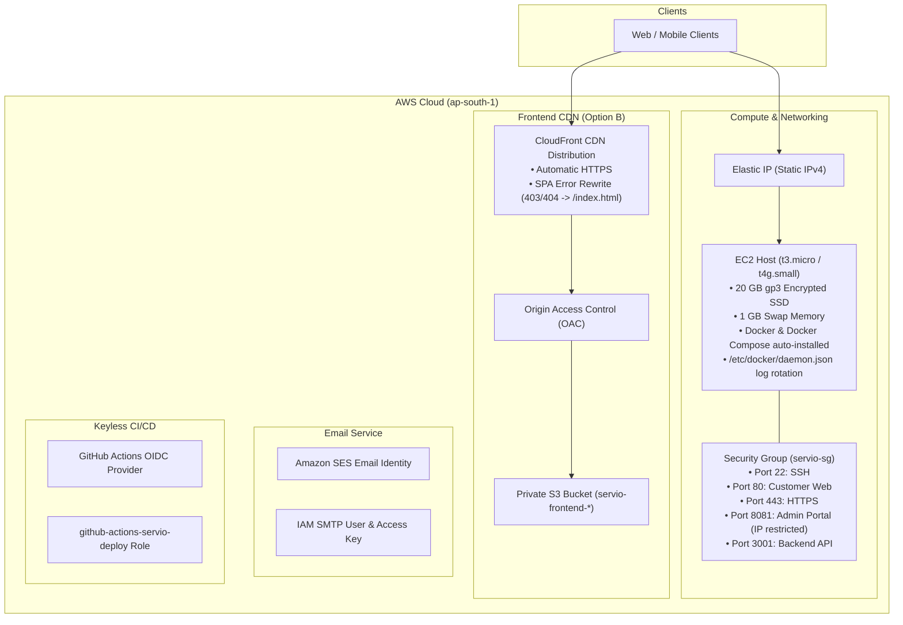

# Servio — Infrastructure as Code (Terraform)

This directory contains the production-ready Terraform modules to provision the entire AWS infrastructure for the **Servio** vehicle service management platform.

---

## 🏗️ Architecture Provisioned



---

## 📋 Prerequisites

1. **Terraform CLI**: Install Terraform (`>= 1.5.0`):
   ```bash
   brew tap hashicorp/tap
   brew install hashicorp/tap/terraform
   # Verify
   terraform -version
   ```
2. **AWS CLI & Credentials**:
   ```bash
   aws configure
   # Provide your AWS Access Key ID, Secret Access Key, and region (ap-south-1)
   ```
3. **EC2 Key Pair**: Ensure you have created a Key Pair named `servio-key` (or your chosen name) in the AWS EC2 console, and downloaded `servio-key.pem`.

---

## 🚀 Quickstart Deployment

### 1. Initialize Configuration
From the repository root:
```bash
cd terraform
cp terraform.tfvars.example terraform.tfvars
```

Edit `terraform.tfvars` with your settings:
```hcl
aws_region        = "ap-south-1"
instance_type     = "t3.micro"       # Free tier (or "t4g.small" for production)
key_name          = "servio-key"
ssh_allowed_cidr  = "203.0.113.50/32" # Your personal/office IP for SSH
admin_allowed_cidr = "203.0.113.50/32" # Restrict Admin portal port 8081
ses_sender_email  = "noreply@servio.lk"
github_repository = "Servio-LK/Servio"
```

### 2. Initialize Terraform
Downloads the required `hashicorp/aws` and `hashicorp/tls` providers:
```bash
terraform init
```

### 3. Review Plan
Inspect the resources Terraform will create before applying:
```bash
terraform plan
```

### 4. Apply & Provision Infrastructure
```bash
terraform apply
```
Type `yes` when prompted. In ~2–3 minutes, AWS will finish creating the instance, S3 bucket, CloudFront distribution, SES identity, and IAM roles!

---

## 📤 Terraform Outputs & Next Steps

When `terraform apply` finishes, it outputs key values:

```
Outputs:

admin_portal_url       = "http://13.233.x.x:8081"
backend_api_url        = "http://13.233.x.x:3001"
cloudfront_domain_name = "https://d1234567890.cloudfront.net"
customer_portal_url    = "http://13.233.x.x"
elastic_ip             = "13.233.x.x"
github_actions_role_arn = "arn:aws:iam::123456789012:role/github-actions-servio-deploy"
s3_frontend_bucket     = "servio-frontend-123456789012"
ses_smtp_host          = "email-smtp.ap-south-1.amazonaws.com"
ses_smtp_username      = "AKIA..."
ssh_command            = "ssh -i servio-key.pem ubuntu@13.233.x.x"
```

### Step 1: Connect to the EC2 Host
```bash
ssh -i /path/to/servio-key.pem ubuntu@<elastic_ip>
```
> Note: On first boot, the cloud-init script runs for ~60 seconds to configure swap and install Docker. Verify with:
> `cat /var/log/servio-init.log` and `docker --version`.

### Step 2: Configure Supabase Custom SMTP
To view the generated SES SMTP password:
```bash
terraform output -raw ses_smtp_password
```
Copy the host (`email-smtp.ap-south-1.amazonaws.com`), username, and password into:
**Supabase Dashboard** → **Project** → **Authentication** → **SMTP Settings**.

### Step 3: Configure GitHub Actions Secrets
In your GitHub repo → **Settings** → **Secrets and variables** → **Actions**:
* `EC2_HOST`: Set to `elastic_ip`
* `EC2_SSH_KEY`: Paste the contents of `servio-key.pem`
* `AWS_ROLE_ARN`: Set to `github_actions_role_arn` (No static AWS keys needed!)
* `CLOUDFRONT_DISTRIBUTION_ID`: Found in CloudFront console if using Option B

---

## 🧹 Destroying Infrastructure

To terminate all provisioned AWS resources cleanly to avoid incurring costs:
```bash
terraform destroy
```
Type `yes` to confirm. Terraform will tear down the EC2 instance, release the Elastic IP, empty and delete the S3 bucket, delete the CloudFront distribution, and clean up the IAM roles.
